# Workflow: workflow-grafana-alert-auto-restart

## Ringkasan

| Item | Detail |
|---|---|
| **Nama Workflow** | workflow-grafana-alert-auto-restart |
| **Tujuan** | Menerima alert dari Grafana Monitoring, menganalisis firing/resolve dengan AI, dan otomatis restart service jika diperlukan |
| **Trigger** | Webhook (dipanggil oleh Grafana Monitoring) |
| **Status** | Aktif |
| **File Export** | `workflows/workflow-grafana-alert-auto-restart.json` |
| **Config Node** | `configs/workflow-grafana-alert-auto-restart/` |
| **Pemilik / PIC** | Fadel |
| **Terakhir Diupdate** | 2026-07-13 |

## Deskripsi

Workflow ini menerima webhook alert dari Grafana Monitoring. Alert kemudian dipilah berdasarkan status **Firing** atau **Resolve**. Jika firing, sistem mengambil log terkait dan menganalisisnya dengan AI, mengirim notifikasi awal, lalu mengecek apakah alert perlu direstart atau di-resolve. Jika keputusan mengarah ke restart, workflow masuk ke bagian **Action Restart Service**, yang mengambil private key, menjalankan script restart, memonitor status service, dan mengirim notifikasi hasil akhir (sukses atau error) ke channel terkait.

## Alur Workflow

```mermaid
flowchart LR
    subgraph IW["Incoming Webhook"]
        A["Webhook<br/>(dari Grafana Monitoring)"] --> B["Selection Alert<br/>(cek Firing/Resolve)"]
    end

    subgraph AIA["AI Alert Analyzer"]
        B -- Firing --> C["Parse Firing Output"]
        C --> D["Send Alert<br/>(notifikasi awal)"]
        D --> E["Get Logs Alert<br/>(execute command)"]
        E --> F["AI Analyze Logs Alert"]
        B -- Resolve --> G["Parse Resolve Output"]
        G --> F
    end

    subgraph SA["Send Alert"]
        F --> H["Send Alert Message"]
        H --> I["Check Firing or Resolve"]
        I --> J["Restart Message"]
    end

    subgraph ARS["Action Restart Service"]
        J --> K["Get Private Key"]
        K -- Success --> L["Parse Script"]
        L --> M["Restart Service"]
        M --> N["Wait"]
        N --> O["Check Status Service"]
        O --> P["Check Status"]
        P -- Success --> Q["Success Restart<br/>(send message)"]
        P -- Error --> R["Error Notification<br/>(send message)"]
        K -- Error --> R
        M -- Error --> R
        R -.-> O
    end
```

## Daftar Node per Grup

### 1. Incoming Webhook
Menerima webhook dari Grafana Monitoring sebagai titik masuk workflow.

| No | Nama Node | Tipe Node (perkiraan) | Fungsi Singkat |
|---|---|---|---|
| 1 | Webhook | `n8n-nodes-base.webhook` | Endpoint penerima alert dari Grafana Monitoring |
| 2 | Selection Alert | `n8n-nodes-base.if` / `switch` | Memilah alert berdasarkan status Firing atau Resolve |

### 2. AI Alert Analyzer
Menganalisis alert secara otomatis menggunakan AI berdasarkan log yang diambil.

| No | Nama Node | Tipe Node (perkiraan) | Fungsi Singkat |
|---|---|---|---|
| 3 | Parse Firing Output | `n8n-nodes-base.set` (`{}`) | Mem-parsing/format data saat alert berstatus Firing |
| 4 | Send Alert | Telegram / messaging (`sendMessage`) | Mengirim notifikasi awal saat alert firing |
| 5 | Get Logs Alert | `n8n-nodes-base.executeCommand` | Mengambil log terkait alert untuk dianalisis |
| 6 | AI Analyze Logs Alert | AI Agent / LangChain node | Menganalisis log alert menggunakan AI, output berupa teks keputusan |
| 7 | Parse Resolve Output | `n8n-nodes-base.set` (`{}`) | Mem-parsing/format data saat alert berstatus Resolve |

### 3. Send Alert
Mengirim hasil analisis dan menentukan aksi lanjutan.

| No | Nama Node | Tipe Node (perkiraan) | Fungsi Singkat |
|---|---|---|---|
| 8 | Send Alert Message | Telegram / messaging (`sendMessage`) | Mengirim pesan hasil analisis AI ke channel notifikasi |
| 9 | Check Firing or Resolve | `n8n-nodes-base.if` | Menentukan apakah alert perlu masuk ke proses restart atau cukup di-resolve |
| 10 | Restart Message | Telegram / messaging (`sendMessage`) | Mengirim pesan bahwa proses restart service akan dijalankan |

### 4. Action Restart Service
Melakukan eksekusi restart service secara otomatis dan memverifikasi hasilnya.

| No | Nama Node | Tipe Node (perkiraan) | Fungsi Singkat |
|---|---|---|---|
| 11 | Get Private Key | `n8n-nodes-base.executeCommand` / credential fetch | Mengambil private key (misal SSH key) untuk akses ke server |
| 12 | Parse Script | `n8n-nodes-base.set` (`{}`) | Menyusun script restart yang akan dieksekusi |
| 13 | Restart Service | `n8n-nodes-base.executeCommand` / SSH | Menjalankan perintah restart pada service target |
| 14 | Wait | `n8n-nodes-base.wait` | Jeda waktu sebelum mengecek status service |
| 15 | Check Status Service | `n8n-nodes-base.executeCommand` | Mengecek status service setelah restart |
| 16 | Check Status | `n8n-nodes-base.if` | Evaluasi apakah service sudah berjalan normal (Success/Error) |
| 17 | Success Restart | Telegram / messaging (`sendMessage`) | Mengirim notifikasi bahwa restart berhasil |
| 18 | Error Notification | Telegram / messaging (`sendMessage`) | Mengirim notifikasi bila proses restart/pengecekan gagal, lalu loop kembali ke Check Status Service |

## Dependency Eksternal

- **Grafana Monitoring** — sumber webhook alert masuk dari node-exporter.
- **Telegram (atau platform messaging lain)** — digunakan di beberapa node `sendMessage` untuk notifikasi (Send Alert, Send Alert Message, Restart Message, Success Restart, Error Notification).
- **Server/Service Target** — diakses melalui SSH/private key untuk eksekusi command restart dan pengecekan status.
- **AI Model** — digunakan di node "AI Analyze Logs Alert" untuk menganalisis log.

## Environment Variable yang Dibutuhkan (perkiraan)

| Variable | Deskripsi |
|---|---|
| `GRAFANA_WEBHOOK_SECRET` | Secret/token untuk validasi webhook dari Grafana (jika ada) |
| `TELEGRAM_BOT_TOKEN` | Token bot untuk mengirim notifikasi |
| `SSH_PRIVATE_KEY` | Private key untuk akses server saat restart service |
| `AI_API_KEY` | API key untuk model AI yang dipakai di node analisis log |

## Catatan & Known Issues

- Terdapat loop dari **Error Notification** kembali ke **Check Status Service** — pastikan ada batas retry/maksimum percobaan agar tidak infinite loop jika service gagal restart terus-menerus.
- Percabangan **Check Firing or Resolve** menentukan apakah alert benar-benar butuh restart otomatis — pastikan logika ini terdokumentasi dengan jelas untuk menghindari restart yang tidak perlu.

## Riwayat Perubahan

| Tanggal | Perubahan | Oleh |
|---|---|---|
| 2026-07-13 | Versi awal dokumentasi berdasarkan diagram workflow | Fadel Muhammad |