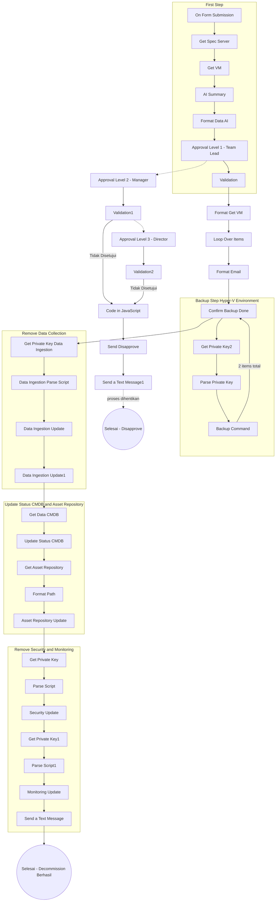

# Workflow: Server-Decommissioning

## Ringkasan

| Item | Detail |
|---|---|
| **Nama Workflow** | Server-Decommissioning |
| **Tujuan** | Mengotomasi proses decommission server: approval berjenjang, backup VM, penghapusan data collection, update status CMDB/Asset Repository, hingga pelepasan konfigurasi security & monitoring |
| **Trigger** | Form submission (`On form submission`) |
| **Status** | Aktif |
| **File Export** | `workflows/Server-Decommissioning.json` |
| **Config Node** | `configs/Server-Decommissioning/` |
| **Pemilik / PIC** | Fadel |
| **Terakhir Diupdate** | 2026-07-20 |

## Deskripsi

Workflow ini dimulai saat ada pengajuan form decommission server. Sistem mengambil spesifikasi server dan daftar VM dari CMDB, meringkasnya dengan AI, lalu meminta approval berjenjang (Team Lead → Manager → Director). Jika salah satu approval ditolak, proses dihentikan dan notifikasi disapprove dikirim. Jika semua approval disetujui, workflow lanjut ke proses backup VM (Hyper-V), penghapusan data collection monitoring, update status di CMDB & Asset Repository menjadi *inactive*, serta pelepasan konfigurasi security dan monitoring service. Notifikasi akhir dikirim melalui pesan (Telegram/messaging).

## Alur Workflow

## Daftar Node per Grup

### 1. First Step
Mengambil data spesifikasi server, list VM, stakeholder, dan penanggung jawab dari CMDB, lalu meminta approval berjenjang.

| No | Nama Node | Tipe Node (perkiraan) | Fungsi Singkat |
|---|---|---|---|
| 1 | On Form Submission | `n8n-nodes-base.formTrigger` | Trigger workflow saat form decommission diajukan |
| 2 | Get Spec Server | `n8n-nodes-base.httpRequest` | Mengambil data spesifikasi server dari CMDB |
| 3 | Get VM | `n8n-nodes-base.httpRequest` | Mengambil daftar VM terkait server |
| 4 | AI Summary | AI Agent / LangChain node | Meringkas data server & VM dengan AI |
| 5 | Format Data AI | `n8n-nodes-base.set` (`{}`) | Merapikan hasil ringkasan AI |
| 6 | Approval Level 1 - Team Lead | Messaging (`sendAndWait`) | Meminta approval pertama ke Team Lead |
| 7 | Validation | `n8n-nodes-base.if` | Memvalidasi hasil approval Team Lead |
| 8 | Approval Level 2 - Manager | Messaging (`sendAndWait`) | Meminta approval ke Manager |
| 9 | Validation1 | `n8n-nodes-base.if` | Memvalidasi hasil approval Manager |
| 10 | Approval Level 3 - Director | Messaging (`sendAndWait`) | Meminta approval ke Director |
| 11 | Validation2 | `n8n-nodes-base.if` | Memvalidasi hasil approval Director |
| 12 | Code in JavaScript | `n8n-nodes-base.code` | Menyusun pesan/payload saat approval ditolak |
| 13 | Send Disapprove | Messaging (`sendMessage`) | Mengirim notifikasi bahwa pengajuan ditolak |

### 2. Loop & Persiapan Backup

| No | Nama Node | Tipe Node (perkiraan) | Fungsi Singkat |
|---|---|---|---|
| 14 | Format Get VM | `n8n-nodes-base.set` (`{}`) | Merapikan data VM sebelum diproses per item |
| 15 | Loop Over Items | `n8n-nodes-base.splitInBatches` | Memproses tiap VM satu per satu |
| 16 | Format Email | `n8n-nodes-base.set` (`{}`) | Menyusun format email/pesan konfirmasi |
| 17 | Confirm Backup Done | Messaging (`sendAndWait`) | Menunggu konfirmasi bahwa backup VM telah selesai |

### 3. Backup Step Hyper-V Environment
Melakukan backup VM secara otomatis berdasarkan IP Management.

| No | Nama Node | Tipe Node (perkiraan) | Fungsi Singkat |
|---|---|---|---|
| 18 | Get Private Key2 | `n8n-nodes-base.executeCommand` / credential fetch | Mengambil private key untuk akses Hyper-V host |
| 19 | Parse Private Key | `n8n-nodes-base.set` (`{}`) | Menyusun format private key untuk eksekusi |
| 20 | Backup Command | `n8n-nodes-base.executeCommand` | Menjalankan perintah backup VM |

### 4. Remove Data Collection
Menghapus data collection melalui parameter IP management di dalam script.

| No | Nama Node | Tipe Node (perkiraan) | Fungsi Singkat |
|---|---|---|---|
| 21 | Get Private Key Data Ingestion | `n8n-nodes-base.executeCommand` / credential fetch | Mengambil private key untuk akses server data ingestion |
| 22 | Data Ingestion Parse Script | `n8n-nodes-base.set` (`{}`) | Menyusun script penghapusan data collection |
| 23 | Data Ingestion Update | `n8n-nodes-base.executeCommand` | Menjalankan penghapusan/update konfigurasi data ingestion |
| 24 | Data Ingestion Update1 | `n8n-nodes-base.executeCommand` | Lanjutan proses update/verifikasi data ingestion |

### 5. Update Status CMDB and Asset Repository
Mengubah status server menjadi *inactive* setelah backup selesai.

| No | Nama Node | Tipe Node (perkiraan) | Fungsi Singkat |
|---|---|---|---|
| 25 | Get Data CMDB | `n8n-nodes-base.httpRequest` | Mengambil data server terkini dari CMDB |
| 26 | Update Status CMDB | `n8n-nodes-base.httpRequest` | Mengubah status server di CMDB menjadi inactive |
| 27 | Get Asset Repository | `n8n-nodes-base.httpRequest` | Mengambil data aset terkait server dari Asset Repository |
| 28 | Format Path | `n8n-nodes-base.set` (`{}`) | Menyusun path/parameter untuk update asset |
| 29 | Asset Repository Update | `n8n-nodes-base.httpRequest` | Mengupdate status aset di Asset Repository |

### 6. Remove Security and Monitoring
Melepas konfigurasi server dari sistem security dan monitoring.

| No | Nama Node | Tipe Node (perkiraan) | Fungsi Singkat |
|---|---|---|---|
| 30 | Get Private Key | `n8n-nodes-base.executeCommand` / credential fetch | Mengambil private key untuk akses server security |
| 31 | Parse Script | `n8n-nodes-base.set` (`{}`) | Menyusun script untuk update konfigurasi security |
| 32 | Security Update | `n8n-nodes-base.executeCommand` | Menjalankan update/pelepasan konfigurasi security |
| 33 | Get Private Key1 | `n8n-nodes-base.executeCommand` / credential fetch | Mengambil private key untuk akses server monitoring |
| 34 | Parse Script1 | `n8n-nodes-base.set` (`{}`) | Menyusun script untuk update konfigurasi monitoring |
| 35 | Monitoring Update | `n8n-nodes-base.executeCommand` | Menjalankan update/pelepasan konfigurasi monitoring |
| 36 | Send a Text Message | Messaging (`sendMessage`) | Mengirim notifikasi akhir bahwa decommission berhasil |
| 37 | Send a Text Message1 | Messaging (`sendMessage`) | Mengirim notifikasi terkait proses disapprove/penghentian |

## Dependency Eksternal

- **CMDB** — sumber data spesifikasi server, VM, dan status aset.
- **Asset Repository** — sistem pencatatan aset yang perlu diupdate saat decommission.
- **AI Model** — digunakan di node "AI Summary" untuk meringkas data server/VM.
- **Approval/Messaging Platform** (Teams/Slack/Email — sesuaikan) — digunakan di node approval berjenjang dan notifikasi.
- **Hyper-V Host** — diakses melalui SSH/private key untuk proses backup VM.
- **Server Data Ingestion / Monitoring / Security** — diakses melalui SSH/private key untuk penghapusan/update konfigurasi.
- **Telegram (atau platform messaging lain)** — untuk notifikasi akhir (`Send a Text Message`, `Send a Text Message1`).

## Environment Variable yang Dibutuhkan

| Variable | Deskripsi |
|---|---|
| `CMDB_API_URL` | Base URL API CMDB |
| `CMDB_API_KEY` | API key/token untuk akses CMDB |
| `ASSET_REPOSITORY_API_URL` | Base URL API Asset Repository |
| `ASSET_REPOSITORY_API_KEY` | API key/token untuk akses Asset Repository |
| `AI_API_KEY` | API key untuk model AI di node AI Summary |
| `APPROVAL_TEAM_LEAD_CHANNEL` | ID/channel tujuan approval Team Lead |
| `APPROVAL_MANAGER_CHANNEL` | ID/channel tujuan approval Manager |
| `APPROVAL_DIRECTOR_CHANNEL` | ID/channel tujuan approval Director |
| `HYPERV_SSH_PRIVATE_KEY_PATH` | Private key untuk akses host Hyper-V (backup VM) |
| `DATA_INGESTION_SSH_PRIVATE_KEY_PATH` | Private key untuk akses server data ingestion |
| `SECURITY_SSH_PRIVATE_KEY_PATH` | Private key untuk akses server security |
| `MONITORING_SSH_PRIVATE_KEY_PATH` | Private key untuk akses server monitoring |
| `TELEGRAM_BOT_TOKEN` | Token bot untuk notifikasi akhir |
| `TELEGRAM_CHAT_ID` | Chat ID tujuan notifikasi |

## Riwayat Perubahan

| Tanggal | Perubahan | Oleh |
|---|---|---|
| 2026-07-20 | Versi awal dokumentasi berdasarkan diagram workflow |  Fadel |